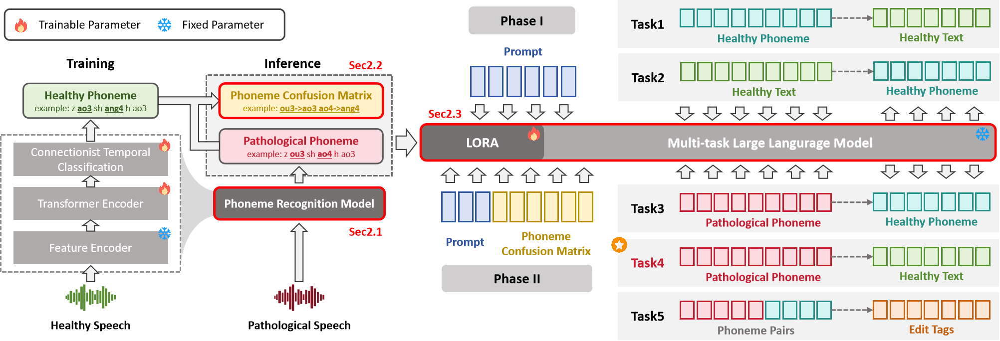

# PhoenixDSR: Phoneme-Guided and LLM-Enhanced Dysarthric Speech Recognition

## 📖 Introduction
Dysarthric speech recognition remains challenging due to data scarcity and speaker heterogeneity.  
We present **PhoenixDSR**, a **phoneme-mediated and LLM-enhanced** framework that decouples acoustic variability from linguistic decoding:

- 🎙️ **Wav2Vec2-CTC phoneme recognizer** trained on healthy speech for stable phoneme sequences.
- 🔄 **Phoneme confusion matrix** (global + personalized) to capture systematic error patterns.
- 🤖 **Lightweight LLM decoder** fine-tuned with multi-task objectives (phoneme↔text, normalization, edit prediction).
- ⚡ **Few-shot personalization** by updating only the confusion prior, no gradient updates needed.

On the **CDSD** dataset, PhoenixDSR achieves **18.3% CER** and **13.7% PER**, outperforming strong baselines and text-only post-editing.

---

## 🚀 Features
- Phoneme-level modeling for interpretable correction.  
- Global + speaker-specific confusion priors.  
- Multi-task LLM fine-tuning with phonotactic pretraining.  
- Efficient few-shot personalization.  

---

Coming Soon